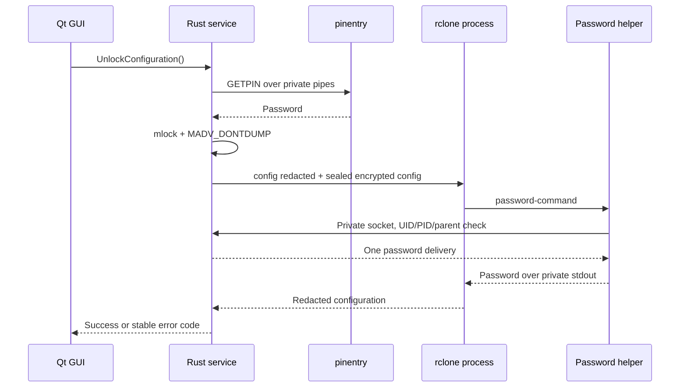

# Authentication and session lifetime

Implemented: encrypted rclone configuration unlock through pinentry, with the
password retained only for the Rust service session. There is no KWallet/keyring
password storage or automatic unlock. Automated tests use synthetic passwords.

Pinentry requests the password set by `rclone config` to protect `rclone.conf`.
It does not request the crypt remote password/salt, Storage Box account password,
or SSH private-key passphrase. Prompts are bilingual so independently activated
backend dialogs remain understandable regardless of GUI language selection.

## Trust boundaries

- The GUI never receives or transmits passwords. D-Bus carries only fixed requests
  and typed state. The dialog is `pinentry-qt` when available, otherwise
  `pinentry-gnome3`.
- Every unlock uses a new pinentry process. The application never opts in to the
  external password cache or sends `SETKEYINFO`, and does not change GnuPG config.
- A session secret occupies an `mmap` page protected by `mlock` and
  `MADV_DONTDUMP`. Drop zeroizes it before `munlock`/`munmap`. Bounded transient
  Rust copies are zeroized; pinentry and rclone control their own copies.
- The service disables dumpability before collecting the password, and the helper
  does the same. This does not claim that rclone or the kernel has no transient copy.
- The password channel uses a 0700 directory, 0600 socket, and one delivery. The
  broker verifies helper UID and parent PID against the newly started rclone
  process; the helper verifies the broker UID/PID.
- Root or full compromise of the user's desktop session is outside this boundary.

## Configuration policy

Unlock opens the encrypted file with ownership/mode-0600 checks and no symlink
resolution. It is copied into a sealed memfd readable—but not writable—by rclone.
The original remains untouched. External changes require lock/unlock; an active
session continues using one coherent snapshot.

`config redacted` is parsed internally and never reaches GUI or logs. Validation
requires the exact case-sensitive `hetzner-crypt` → `hetzner-raw:encrypted-data`
chain, content/name encryption, SFTP port 23, agent authentication, a configured
host-key pin, and the expected SSH key path. It rejects external SSH commands,
proxies, insecure cipher switches, persistent TOFU, and `global.*`/`override.*`
options that could replace fixed command policy.

No Storage Box account identifier is compiled into source. Host and user come
from explicit local service policy and must match the strict
`u<digits>.your-storagebox.de`/`u<digits>[-subaccount]` relationship. The expected
key defaults to `$HOME/.ssh/hetzner_storagebox`; `HETZNER_DRIVE_SSH_KEY` may select
a different direct child of `$HOME/.ssh`. The redacted configuration must contain
the corresponding masked fields, expected key path, and fixed secure structure.
rclone network commands reuse the same validated sealed snapshot while fixed
overrides anchor host/user/port/key and enforce agent use, host-key checking,
disabled password prompts, and bounded retries/timeouts.

Serialized values are not truncated at `#` or `;`. A process that exits before
requesting its password fails immediately instead of waiting for the 30-second
operation timeout.

## Lifetime and lock behavior

- The rclone configuration password remains available until
  `LockConfiguration` or service exit.
- Closing or exiting the GUI does not automatically stop the service.
- Lock removes the controller's password reference but cannot revoke plaintext
  already exposed by an existing rclone/FUSE mount.
- There is no automatic unlock or persistent secret storage after restart.
- SSH keychain expiry is independent of the rclone configuration password.

The restic repository password is separate. It uses the same protected-memory and
peer-checked one-shot principles, is removed by restic lock/configuration lock/
service exit, and never travels through D-Bus, argv, or a persistent environment.

## Verification

`cargo test --test auth_flow` creates a temporary encrypted configuration through
real rclone, validates correct/incorrect synthetic passwords, unchanged config,
and socket cleanup. It never contacts Hetzner. Unit tests also reject unauthorized
peers, unsafe overrides, invalid host/user relationships, and missing host pins.

Primary references:

- <https://rclone.org/docs/#configuration-encryption>
- <https://rclone.org/commands/rclone_config_encryption_set/>
- <https://rclone.org/commands/rclone_config_redacted/>
- <https://rclone.org/docs/#valid-remote-names>
- <https://rclone.org/docs/#adding-global-configuration-to-a-remote>
- <https://github.com/gpg/pinentry/blob/master/pinentry/pinentry.c>
